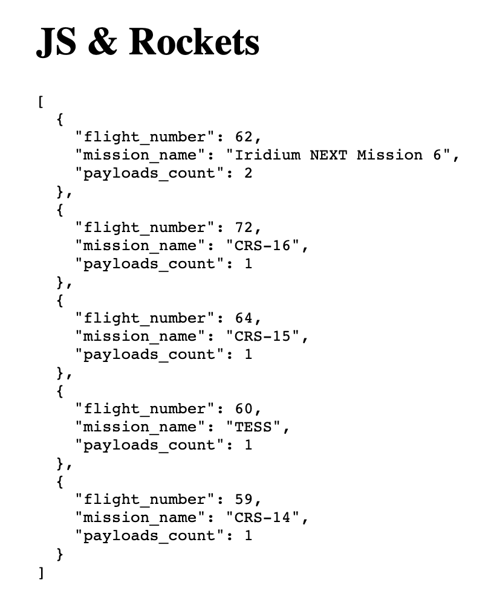

# Nasa Customers

### Description

This application consolidate a list of all the missions that were launched in 
2018 that carried a payload that belonged to NASA. Missions should appear in 
inverse chronological order with the exception that those that carried 
more payloads that should appear first.
Displaying the outcome by rendering the list to the screen as JSON while keeping
an indentation of 2 spaces.


###### Sample screen:



### Get it running

- Install the dependencies -  ``` npm install ```
- Run the application - ``` npm start ```
- Run the tests - ``` npm test ```
